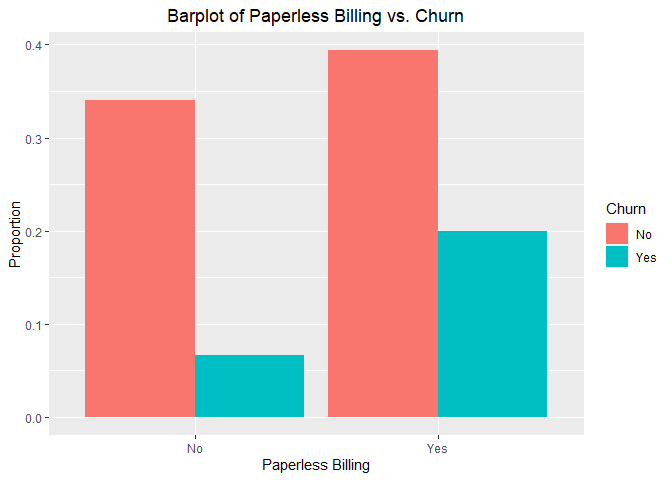

Telco Customer Churn Prediction
================
Seyoung Jung
12/11/2018

-----

# 1 Objective

Predict behavior to retain customers. You can analyze all relevant
customer data and develop focused customer retention programs.

-----

# 2 Data

Each row represents a customer, each column contains customer’s
attributes described on the column Metadata. The raw data contains 7043
rows (customers) and 21 columns (features). The “Churn” column is our
target.

  - **customerID**: Customer ID
  - **gender**: Customer gender (female, male)
  - **SeniorCitizen**: Whether the customer is a senior citizen or not
    (1,0)
  - **Partner**: Whether the customer has a partner or not (Yes, No)
  - **Dependents**: Whether the customer has dependents or not (Yes, No)
  - **tenure**: Number of months the customer has stayed with the
    company
  - **PhoneService**: Whether the customer has a phone service or not
    (Yes, No)
  - **MultipleLines**: Whether the customer has multiple lines or not
    (Yes, No, No phone service)
  - **InternetService**: Customer’s internet service provider (DSL,
    Fiber optic, No)
  - **OnlineSecurity**: Whether the customer has online security or not
    (Yes, No, No internet service)
  - **OnlineBackup**: Whether the customer has online backup or not
    (Yes, No, No internet service)
  - **DeviceProtection**: Whether the customer has device protection or
    not (Yes, No, No internet service)
  - **TechSupport**: Whether the customer has tech support or not (Yes,
    No, No internet service)
  - **StreamingTV**: Whether the customer has streaming TV or not (Yes,
    No, No internet service)
  - **StreamingMovies**: Whether the customer has streaming movies or
    not (Yes, No, No internet service)
  - **Contract**: The contract term of the customer (Month-to-month, One
    year, Two year)
  - **PaperlessBilling**: Whether the customer has paperless billing or
    not (Yes, No)
  - **PaymentMethod**: The customer’s payment method (Electronic check,
    Mailed check, Bank transfer (automatic), Credit card (automatic))
  - **MonthlyCharges**: The amount charged to the customer monthly
  - **TotalCharges**: The total amount charged to the customer
  - **Churn**: Whether the customer churned or not (Yes or No)

-----

# 3 Packages

``` r
library(readr)      # read_csv
library(dplyr)      # glimpse, 
library(tidyr)
library(caTools)    # sample.split 
```

    ## Warning: package 'caTools' was built under R version 4.0.2

``` r
library(ggplot2)    # ggplot
library(reshape2)   # melt
library(gridExtra)  # grid.arrange
library(corrplot)   # corrplot
```

    ## Warning: package 'corrplot' was built under R version 4.0.2

``` r
library(MASS)       # stepAIC
```

-----

# 4 Data Cleaning

Load the dataset into R and get a glimpse of our data.

``` r
telcodata <- read_csv("telcodata.csv")
glimpse(telcodata)
```

    ## Rows: 7,043
    ## Columns: 21
    ## $ customerID       <chr> "7590-VHVEG", "5575-GNVDE", "3668-QPYBK", "7795-CF...
    ## $ gender           <chr> "Female", "Male", "Male", "Male", "Female", "Femal...
    ## $ SeniorCitizen    <dbl> 0, 0, 0, 0, 0, 0, 0, 0, 0, 0, 0, 0, 0, 0, 0, 0, 0,...
    ## $ Partner          <chr> "Yes", "No", "No", "No", "No", "No", "No", "No", "...
    ## $ Dependents       <chr> "No", "No", "No", "No", "No", "No", "Yes", "No", "...
    ## $ tenure           <dbl> 1, 34, 2, 45, 2, 8, 22, 10, 28, 62, 13, 16, 58, 49...
    ## $ PhoneService     <chr> "No", "Yes", "Yes", "No", "Yes", "Yes", "Yes", "No...
    ## $ MultipleLines    <chr> "No phone service", "No", "No", "No phone service"...
    ## $ InternetService  <chr> "DSL", "DSL", "DSL", "DSL", "Fiber optic", "Fiber ...
    ## $ OnlineSecurity   <chr> "No", "Yes", "Yes", "Yes", "No", "No", "No", "Yes"...
    ## $ OnlineBackup     <chr> "Yes", "No", "Yes", "No", "No", "No", "Yes", "No",...
    ## $ DeviceProtection <chr> "No", "Yes", "No", "Yes", "No", "Yes", "No", "No",...
    ## $ TechSupport      <chr> "No", "No", "No", "Yes", "No", "No", "No", "No", "...
    ## $ StreamingTV      <chr> "No", "No", "No", "No", "No", "Yes", "Yes", "No", ...
    ## $ StreamingMovies  <chr> "No", "No", "No", "No", "No", "Yes", "No", "No", "...
    ## $ Contract         <chr> "Month-to-month", "One year", "Month-to-month", "O...
    ## $ PaperlessBilling <chr> "Yes", "No", "Yes", "No", "Yes", "Yes", "Yes", "No...
    ## $ PaymentMethod    <chr> "Electronic check", "Mailed check", "Mailed check"...
    ## $ MonthlyCharges   <dbl> 29.85, 56.95, 53.85, 42.30, 70.70, 99.65, 89.10, 2...
    ## $ TotalCharges     <dbl> 29.85, 1889.50, 108.15, 1840.75, 151.65, 820.50, 1...
    ## $ Churn            <chr> "No", "No", "Yes", "No", "Yes", "Yes", "No", "No",...

Check if there are missing data. We will delete the corresponding rows.

``` r
MVinfo <- apply(is.na(telcodata), 2, which)     # 11 missing data
withoutMV <- telcodata[-MVinfo$TotalCharges, ]
```

Coerce all the variables to factor variables except for customerID,
SeniorCitizen, tenure, MonthlyCharges, and TotalCharges.

``` r
cols <- c(1, 3, 6, 19, 20)
withoutMV[,-cols] <- data.frame(apply(withoutMV[-cols], 2, as.factor))
```

Coerce the SeniorCitizen variable to a factor. 1: Yes, 0: No. 

``` r
withoutMV <- withoutMV %>% mutate(SeniorCitizen = ifelse(SeniorCitizen == 0, "No", "Yes"))
withoutMV$SeniorCitizen <- as.factor(withoutMV$SeniorCitizen)
```

Get rid of the customerID variable

``` r
cleandata <- withoutMV[, 2:21]
```

Create a new column that classifies the elements by years, and get rid
of tenure and TotalCharges.

``` r
cleandata <- mutate(cleandata, Year=ifelse(tenure %in% 1:12, "0-1", 
                                           ifelse(tenure %in% 13:24, "1-2", 
                                                  ifelse(tenure %in% 25:36, "2-3", 
                                                         ifelse(tenure %in% 37:48, "3-4", 
                                                                ifelse(tenure %in% 49:60, "4-5", 
                                                                       ifelse(tenure %in% 61:72, "5-6", "6-7")))))))
cleandata$Year <- as.factor(cleandata$Year)
cleandata$tenure <- NULL
cleandata$TotalCharges <- NULL
```

-----

# 5 Exploratory Data Analysis

<!-- -->

<!-- -->

<!-- -->

<!-- -->

<!-- -->

<!-- -->

<!-- -->

<!-- -->

<!-- -->

<!-- -->

<!-- -->

<!-- -->

<!-- -->

<!-- -->

<!-- -->

<!-- -->

<!-- -->

<!-- -->

-----

# 6 Logistic Regression - Preparation

Make nominal categorical variables to ordinal categorical variables. And
change some of our categorical variables to binary categorical
variables. Regard “No Internet Service” as “No”, and change the
corresponding answers accordingly.

``` r
cleandata<-cleandata%>%mutate(gender=ifelse(gender=="Male",1,0))
cleandata<-cleandata%>%mutate(SeniorCitizen=ifelse(SeniorCitizen=="Yes",1,0))
cleandata<-cleandata%>%mutate(Partner=ifelse(Partner=="Yes",1,0))
cleandata<-cleandata%>%mutate(Dependents=ifelse(Dependents=="Yes",1,0))
cleandata<-cleandata%>%mutate(PhoneService=ifelse(PhoneService=="Yes",1,0))
cleandata<-cleandata%>%mutate(MultipleLines=ifelse(MultipleLines=="Yes",1,0))
cleandata<-cleandata%>%mutate(OnlineSecurity=ifelse(OnlineSecurity=="Yes",1,0))
cleandata<-cleandata%>%mutate(OnlineBackup=ifelse(OnlineBackup=="Yes",1,0))
cleandata<-cleandata%>%mutate(DeviceProtection=ifelse(DeviceProtection=="Yes",1,0))
cleandata<-cleandata%>%mutate(TechSupport=ifelse(TechSupport=="Yes",1,0))
cleandata<-cleandata%>%mutate(StreamingTV=ifelse(StreamingTV=="Yes",1,0))
cleandata<-cleandata%>%mutate(StreamingMovies=ifelse(StreamingMovies=="Yes",1,0))
cleandata<-cleandata%>%mutate(PaperlessBilling=ifelse(PaperlessBilling=="Yes",1,0))
cleandata<-cleandata%>%mutate(Churn=ifelse(Churn=="Yes",1,0))
```

Standardize MonthlyCharges variable

``` r
cleandata$MonthlyCharges <- scale(cleandata$MonthlyCharges)
```

Creating a Baseline model

``` r
table(cleandata$Churn)/nrow(cleandata)  # Churn rate: 73.42%
```

    ## 
    ##        0        1 
    ## 0.734215 0.265785

Split the dataset into training and test sets

``` r
set.seed(12345)
sample_size <- floor(0.75 * nrow(cleandata))
sampling_data <- sample(seq_len(nrow(cleandata)), size = sample_size)
train_data <- cleandata[sampling_data, ]
test_data <- cleandata[-sampling_data, ]
```

-----

# 7 Logistic Regression

Fit the logistic regression

``` r
log_reg1 <- glm(Churn ~ ., data=train_data, family=binomial(link="logit"))
summary(log_reg1)
```

    ## 
    ## Call:
    ## glm(formula = Churn ~ ., family = binomial(link = "logit"), data = train_data)
    ## 
    ## Deviance Residuals: 
    ##     Min       1Q   Median       3Q      Max  
    ## -2.0624  -0.6643  -0.2861   0.6632   3.1031  
    ## 
    ## Coefficients:
    ##                                      Estimate Std. Error z value Pr(>|z|)    
    ## (Intercept)                          -1.00267    1.47936  -0.678 0.497918    
    ## gender                               -0.01294    0.07497  -0.173 0.862966    
    ## SeniorCitizen                         0.25549    0.09757   2.619 0.008829 ** 
    ## Partner                              -0.04275    0.08904  -0.480 0.631092    
    ## Dependents                           -0.11678    0.10394  -1.123 0.261244    
    ## PhoneService                          0.01778    0.75602   0.024 0.981240    
    ## MultipleLines                         0.36481    0.20550   1.775 0.075867 .  
    ## InternetServiceFiber optic            1.24651    0.92677   1.345 0.178625    
    ## InternetServiceNo                    -1.33165    0.93788  -1.420 0.155649    
    ## OnlineSecurity                       -0.26289    0.20481  -1.284 0.199282    
    ## OnlineBackup                         -0.10082    0.20361  -0.495 0.620491    
    ## DeviceProtection                      0.03832    0.20470   0.187 0.851509    
    ## TechSupport                          -0.29191    0.20915  -1.396 0.162815    
    ## StreamingTV                           0.44178    0.38027   1.162 0.245335    
    ## StreamingMovies                       0.50332    0.37973   1.325 0.185011    
    ## ContractOne year                     -0.85272    0.12402  -6.876 6.17e-12 ***
    ## ContractTwo year                     -1.68182    0.20611  -8.160 3.35e-16 ***
    ## PaperlessBilling                      0.32882    0.08636   3.808 0.000140 ***
    ## PaymentMethodCredit card (automatic)  0.02050    0.13058   0.157 0.875224    
    ## PaymentMethodElectronic check         0.37380    0.11033   3.388 0.000704 ***
    ## PaymentMethodMailed check             0.08402    0.13314   0.631 0.528006    
    ## MonthlyCharges                       -0.51753    1.10892  -0.467 0.640715    
    ## Year1-2                              -0.95627    0.11223  -8.521  < 2e-16 ***
    ## Year2-3                              -1.30677    0.13332  -9.802  < 2e-16 ***
    ## Year3-4                              -1.28949    0.15215  -8.475  < 2e-16 ***
    ## Year4-5                              -1.43619    0.16439  -8.736  < 2e-16 ***
    ## Year5-6                              -1.74296    0.19735  -8.832  < 2e-16 ***
    ## ---
    ## Signif. codes:  0 '***' 0.001 '**' 0.01 '*' 0.05 '.' 0.1 ' ' 1
    ## 
    ## (Dispersion parameter for binomial family taken to be 1)
    ## 
    ##     Null deviance: 6146.3  on 5273  degrees of freedom
    ## Residual deviance: 4389.4  on 5247  degrees of freedom
    ## AIC: 4443.4
    ## 
    ## Number of Fisher Scoring iterations: 6

Check the deviance

``` r
anova(object=log_reg1, test="Chisq")
```

    ## Analysis of Deviance Table
    ## 
    ## Model: binomial, link: logit
    ## 
    ## Response: Churn
    ## 
    ## Terms added sequentially (first to last)
    ## 
    ## 
    ##                  Df Deviance Resid. Df Resid. Dev  Pr(>Chi)    
    ## NULL                              5273     6146.3              
    ## gender            1     0.68      5272     6145.6 0.4100233    
    ## SeniorCitizen     1   118.63      5271     6027.0 < 2.2e-16 ***
    ## Partner           1   120.32      5270     5906.6 < 2.2e-16 ***
    ## Dependents        1    33.97      5269     5872.7 5.589e-09 ***
    ## PhoneService      1     3.06      5268     5869.6 0.0801560 .  
    ## MultipleLines     1     6.20      5267     5863.4 0.0127412 *  
    ## InternetService   2   493.50      5265     5369.9 < 2.2e-16 ***
    ## OnlineSecurity    1   196.89      5264     5173.0 < 2.2e-16 ***
    ## OnlineBackup      1    87.37      5263     5085.6 < 2.2e-16 ***
    ## DeviceProtection  1    51.73      5262     5033.9 6.373e-13 ***
    ## TechSupport       1    90.22      5261     4943.7 < 2.2e-16 ***
    ## StreamingTV       1     1.86      5260     4941.8 0.1727246    
    ## StreamingMovies   1     1.57      5259     4940.3 0.2108400    
    ## Contract          2   326.27      5257     4614.0 < 2.2e-16 ***
    ## PaperlessBilling  1    14.77      5256     4599.2 0.0001217 ***
    ## PaymentMethod     3    36.77      5253     4562.5 5.151e-08 ***
    ## MonthlyCharges    1     0.38      5252     4562.1 0.5352195    
    ## Year              5   172.74      5247     4389.4 < 2.2e-16 ***
    ## ---
    ## Signif. codes:  0 '***' 0.001 '**' 0.01 '*' 0.05 '.' 0.1 ' ' 1

Evaluate the logistic regression model

``` r
predict_train <- predict(log_reg1, newdata=test_data, type="response")
predict_train <- ifelse(predict_train > 0.5, 1, 0)
predict_error <- mean(predict_train != test_data$Churn)
model1 <- 1 - predict_error
print(model1)
```

    ## [1] 0.8060296

Variable selection

``` r
step <- stepAIC(log_reg1, trace=FALSE)
step$anova
```

    ## Stepwise Model Path 
    ## Analysis of Deviance Table
    ## 
    ## Initial Model:
    ## Churn ~ gender + SeniorCitizen + Partner + Dependents + PhoneService + 
    ##     MultipleLines + InternetService + OnlineSecurity + OnlineBackup + 
    ##     DeviceProtection + TechSupport + StreamingTV + StreamingMovies + 
    ##     Contract + PaperlessBilling + PaymentMethod + MonthlyCharges + 
    ##     Year
    ## 
    ## Final Model:
    ## Churn ~ SeniorCitizen + Dependents + MultipleLines + InternetService + 
    ##     OnlineSecurity + TechSupport + StreamingTV + StreamingMovies + 
    ##     Contract + PaperlessBilling + PaymentMethod + MonthlyCharges + 
    ##     Year
    ## 
    ## 
    ##                 Step Df     Deviance Resid. Df Resid. Dev      AIC
    ## 1                                         5247   4389.351 4443.351
    ## 2     - PhoneService  1 0.0005528943      5248   4389.352 4441.352
    ## 3           - gender  1 0.0298536539      5249   4389.382 4439.382
    ## 4 - DeviceProtection  1 0.1203633877      5250   4389.502 4437.502
    ## 5          - Partner  1 0.2220319537      5251   4389.724 4435.724
    ## 6     - OnlineBackup  1 1.2928400556      5252   4391.017 4435.017

Summary of our second logistic regression model

``` r
summary(step)
```

    ## 
    ## Call:
    ## glm(formula = Churn ~ SeniorCitizen + Dependents + MultipleLines + 
    ##     InternetService + OnlineSecurity + TechSupport + StreamingTV + 
    ##     StreamingMovies + Contract + PaperlessBilling + PaymentMethod + 
    ##     MonthlyCharges + Year, family = binomial(link = "logit"), 
    ##     data = train_data)
    ## 
    ## Deviance Residuals: 
    ##     Min       1Q   Median       3Q      Max  
    ## -2.0557  -0.6661  -0.2869   0.6681   3.1137  
    ## 
    ## Coefficients:
    ##                                      Estimate Std. Error z value Pr(>|z|)    
    ## (Intercept)                          -1.03808    0.20746  -5.004 5.63e-07 ***
    ## SeniorCitizen                         0.24875    0.09696   2.566 0.010301 *  
    ## Dependents                           -0.13904    0.09454  -1.471 0.141365    
    ## MultipleLines                         0.37346    0.10221   3.654 0.000258 ***
    ## InternetServiceFiber optic            1.28322    0.22051   5.819 5.91e-09 ***
    ## InternetServiceNo                    -1.33172    0.20106  -6.623 3.51e-11 ***
    ## OnlineSecurity                       -0.25868    0.10404  -2.486 0.012905 *  
    ## TechSupport                          -0.28556    0.10497  -2.720 0.006520 ** 
    ## StreamingTV                           0.45229    0.11362   3.981 6.87e-05 ***
    ## StreamingMovies                       0.51580    0.11197   4.607 4.09e-06 ***
    ## ContractOne year                     -0.84787    0.12357  -6.861 6.82e-12 ***
    ## ContractTwo year                     -1.67243    0.20558  -8.135 4.11e-16 ***
    ## PaperlessBilling                      0.32473    0.08624   3.765 0.000166 ***
    ## PaymentMethodCredit card (automatic)  0.01862    0.13047   0.143 0.886487    
    ## PaymentMethodElectronic check         0.37143    0.11023   3.370 0.000753 ***
    ## PaymentMethodMailed check             0.08570    0.13297   0.644 0.519256    
    ## MonthlyCharges                       -0.54810    0.19182  -2.857 0.004271 ** 
    ## Year1-2                              -0.96774    0.11135  -8.691  < 2e-16 ***
    ## Year2-3                              -1.32435    0.13166 -10.059  < 2e-16 ***
    ## Year3-4                              -1.31102    0.14864  -8.820  < 2e-16 ***
    ## Year4-5                              -1.47911    0.15863  -9.324  < 2e-16 ***
    ## Year5-6                              -1.79657    0.18933  -9.489  < 2e-16 ***
    ## ---
    ## Signif. codes:  0 '***' 0.001 '**' 0.01 '*' 0.05 '.' 0.1 ' ' 1
    ## 
    ## (Dispersion parameter for binomial family taken to be 1)
    ## 
    ##     Null deviance: 6146.3  on 5273  degrees of freedom
    ## Residual deviance: 4391.0  on 5252  degrees of freedom
    ## AIC: 4435
    ## 
    ## Number of Fisher Scoring iterations: 6

Evaluate the model

``` r
predict_train2 <- predict(step, newdata=test_data, type="response")
predict_train2 <- ifelse(predict_train2 > 0.5, 1, 0)
predict_error2 <- mean(predict_train2 != test_data$Churn)
model2 <- 1 - predict_error2
print(model2)
```

    ## [1] 0.8083049

Confusion matrix

``` r
table(ActualResult = test_data$Churn, Prediction = predict_train > 0.5)
```

    ##             Prediction
    ## ActualResult FALSE TRUE
    ##            0  1178  132
    ##            1   209  239

``` r
table(ActualResult = test_data$Churn, Prediction = predict_train2 > 0.5)
```

    ##             Prediction
    ## ActualResult FALSE TRUE
    ##            0  1177  133
    ##            1   204  244

-----

# 8 Conclusion

To sum up, if we use a cutoff point of 0.5 and just guess without any
statistical models, we will get roughly 73% right. However, we will get
approximately 80% right if we use our second logistic regression model.
And this increased accuracy will help the Telco company predict whether
a customer will churn or not more accurately, and this analysis will be
helpful for them when they develop their business strategy to retain
their customers.
